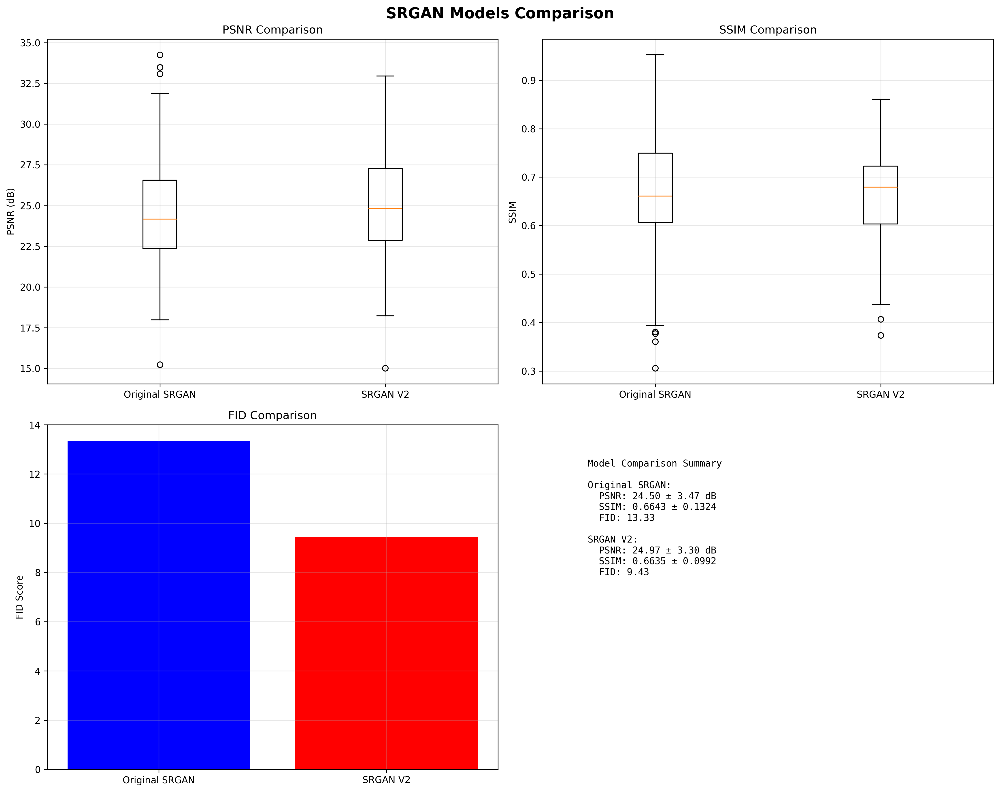
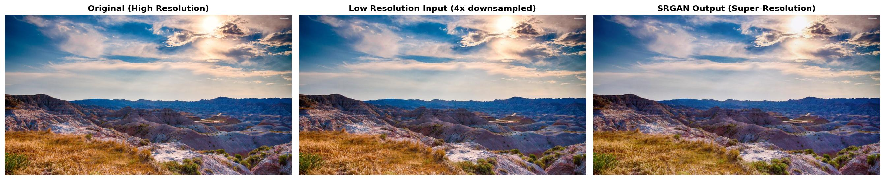

# SRGAN Super-Resolution Project

This repository contains a complete implementation of SRGAN (Super-Resolution Generative Adversarial Network) with two model variants: the original SRGAN and an improved version (v2). The project includes training scripts, evaluation tools, and comprehensive testing capabilities.

## 📋 Table of Contents

- [Overview](#overview)
- [Project Structure](#project-structure)
- [Installation](#installation)
- [Dataset Setup](#dataset-setup)
- [Training](#training)
- [Testing & Evaluation](#testing--evaluation)
- [Model Comparison](#model-comparison)
- [Results & Metrics](#results--metrics)
- [Troubleshooting](#troubleshooting)

## 🎯 Overview

This project implements SRGAN for 4x super-resolution of images. It includes:

- **Original SRGAN**: Standard SRGAN implementation with residual blocks
- **SRGAN v2**: Enhanced version with improved architecture and training strategy
- **Two-stage training**: Pretrain (L1 loss) + Finetune (GAN loss)
- **Comprehensive evaluation**: PSNR, SSIM, FID scores
- **Visual comparisons**: Side-by-side image comparisons

## 📁 Project Structure

```
SRGAN/
├── models/                 # Original SRGAN model
│   └── srgan.py
├── models_v2.py           # Enhanced SRGAN v2 model
├── data/
│   └── dataset.py         # Data loading and preprocessing
├── utils/
│   └── losses.py          # Loss functions for original model
├── losses_v2.py           # Loss functions for v2 model
├── train.py               # Training script for original SRGAN
├── train_v2.py            # Training script for SRGAN v2
├── test_v2_model.py       # Testing script for v2 model
├── test_three_way_comparison.py
├── compute_fid_scores.py  # FID score computation
├── compare_validation.py  # Validation comparison tools
├── checkpoints/           # Original model checkpoints
├── checkpoints_v2/        # v2 model checkpoints
├── logs/                  # Training logs (original)
├── logs_v2/               # Training logs (v2)
├── samples/               # Training samples and plots
├── requirements.txt       # Python dependencies
└── TESTING_README.md      # Detailed testing guide
```

## 🚀 Installation

### Prerequisites

- Python 3.8+
- CUDA-compatible GPU (recommended)
- 8GB+ RAM

### Setup

1. **Clone the repository:**
```bash
git clone [<repository-url>](https://github.com/Razyehuda/SRGAN.git)
cd SRGAN
```

2. **Create virtual environment:**
```bash
python -m venv venv
venv\Scripts\activate  # Windows
# or
source venv/bin/activate  # Linux/Mac
```

3. **Install dependencies:**
```bash
pip install -r requirements.txt
```

### Dependencies

- `torch>=1.9.0` - PyTorch framework
- `torchvision>=0.10.0` - Computer vision utilities
- `numpy>=1.21.0` - Numerical computing
- `Pillow>=8.3.0` - Image processing
- `matplotlib>=3.4.0` - Plotting and visualization
- `tqdm>=4.62.0` - Progress bars
- `opencv-python>=4.5.0` - Computer vision
- `scikit-image>=0.18.0` - Image processing
- `tensorboard>=2.7.0` - Training visualization

## 📊 Dataset Setup

### DIV2K Dataset

The project uses the DIV2K dataset for training and validation. The dataset should be organized as follows:

```
DIV2K/
├── DIV2K_train_HR/       # High-resolution training images
├── DIV2K_train_LR_bicubic/X4/  # Low-resolution training images
├── DIV2K_valid_HR/       # High-resolution validation images
└── DIV2K_valid_LR_bicubic/X4/  # Low-resolution validation images
```

### Dataset Paths

Update the dataset paths in the training scripts:

```python
# In train.py and train_v2.py
DEFAULT_TRAIN_HR = "path/to/DIV2K_train_HR"
DEFAULT_VAL_HR = "path/to/DIV2K_valid_HR"
```

## 🏋️ Training

### Original SRGAN Training

```bash
python train.py \
    --hr_train_dir path/to/DIV2K_train_HR \
    --hr_val_dir path/to/DIV2K_valid_HR \
    --batch_size 16 \
    --num_epochs 100 \
    --g_lr 0.0001 \
    --d_lr 0.0001 \
    --checkpoint_dir checkpoints \
    --log_dir logs \
    --sample_dir samples
```

### SRGAN v2 Training

The v2 model uses a two-stage training approach:

#### Stage 1: Pretrain (L1 Loss)
```bash
python train_v2.py \
    --mode pretrain \
    --hr_train_dir path/to/DIV2K_train_HR \
    --hr_val_dir path/to/DIV2K_valid_HR \
    --batch_size 16 \
    --num_epochs 50 \
    --g_lr 0.001 \
    --checkpoint_dir checkpoints_v2 \
    --log_dir logs_v2 \
    --sample_dir samples_v2
```

#### Stage 2: Finetune (GAN Loss)
```bash
python train_v2.py \
    --mode finetune \
    --hr_train_dir path/to/DIV2K_train_HR \
    --hr_val_dir path/to/DIV2K_valid_HR \
    --batch_size 16 \
    --num_epochs 200 \
    --g_lr 0.0001 \
    --d_lr 0.0001 \
    --checkpoint_dir checkpoints_v2 \
    --log_dir logs_v2 \
    --sample_dir samples_v2
```

### Training Parameters

| Parameter | Original SRGAN | SRGAN v2 |
|-----------|----------------|----------|
| Residual Blocks | 16 | 23 |
| Base Channels | 64 | 64 |
| Batch Size | 16 | 16 |
| Learning Rate | 0.0001 | 0.0001 |
| Epochs | 100 | 50 (pretrain) + 200 (finetune) |

## 🧪 Testing & Evaluation

### Quick Testing

#### Single Image Test
```bash
python test_v2_model.py \
    --checkpoint checkpoints_v2/best_model_finetune.pth \
    --mode single \
    --input test_image.jpg \
    --output sr_output.jpg \
    --compare
```

#### Validation Set Evaluation
```bash
python test_v2_model.py \
    --checkpoint checkpoints_v2/best_model_finetune.pth \
    --mode validation \
    --output validation_results \
    --batch_size 8
```

#### Batch Processing
```bash
python test_v2_model.py \
    --checkpoint checkpoints_v2/best_model_finetune.pth \
    --mode batch \
    --input input_images/ \
    --output output_images/ \
    --max_size 512
```

### Testing Modes

1. **Single Mode**: Process one image with optional comparison
2. **Batch Mode**: Process all images in a directory
3. **Validation Mode**: Evaluate on validation set (PSNR/SSIM)
4. **HR Test Mode**: Create LR from HR and test reconstruction

### Memory Optimization

For large images or limited GPU memory:
```bash
--max_size 512  # Limit image size
--device cpu     # Use CPU instead of GPU
--batch_size 4   # Reduce batch size
```

## 🔍 Model Comparison

### Four-Way Comparison

Compare both models side by side:

```bash
python test_both_models.py \
    --checkpoint1 checkpoints/best_model.pth \
    --checkpoint2 checkpoints_v2/best_model_finetune.pth \
    --output_dir model_comparisons \
    --num_samples 10 \
    --crop_size 256 \
    --no_display
```

This creates comparisons showing:
1. Low Resolution Input (64x64)
2. Model 1 Output (Original SRGAN)
3. Model 2 Output (SRGAN v2)
4. Ground Truth HR (256x256)

### FID Score Evaluation

Compute FID scores for model comparison:

```bash
python compute_fid_scores.py \
    --checkpoint checkpoints_v2/best_model_finetune.pth \
    --hr_dir path/to/validation_hr \
    --output_dir fid_evaluation \
    --num_samples 100
```

## 📈 Results & Metrics

### Performance Metrics

| Model | PSNR (dB) | SSIM | FID Score |
|-------|------------|------|-----------|
| Original SRGAN | 24.50 ± 3.47 | 0.6643 ± 0.1324 | 13.33 |
| SRGAN v2 | 24.97 ± 3.30 | 0.6635 ± 0.0992 | 9.43 |



### Training Curves
### FIRST MODEL

### SECOND MODEL

Generate training plots:

```bash
python create_training_plots.py \
    --log_dir logs_v2 \
    --output_dir training_plots
```
## 👌 Examples:



### Sample Images

Training samples are saved in:
- `samples/` - Original SRGAN samples
- `samples_v2/` - SRGAN v2 samples

## 🔧 Troubleshooting

### Common Issues

#### Memory Errors
- Reduce `--max_size` parameter
- Use `--device cpu`
- Decrease batch size

#### Model Loading Errors
- Verify checkpoint paths
- Check model parameters match training
- Ensure checkpoint files are not corrupted

#### Dataset Issues
- Verify dataset paths are correct
- Check image file formats
- Ensure sufficient disk space

#### CUDA Issues
- Check CUDA version compatibility
- Verify GPU memory availability
- Use CPU fallback if needed

### Debugging Tools

#### Check CUDA Setup
```bash
python check_cuda.py
```

#### Verify Dataset
```bash
python check_dataset.py \
    --hr_dir path/to/hr_images \
    --lr_dir path/to/lr_images
```

#### Test Model Output
```bash
python test_model_output.py \
    --checkpoint checkpoints_v2/best_model_finetune.pth
```

## 📚 Additional Resources

### Documentation
- `TESTING_README.md` - Detailed testing guide
- `TESTING_README.md` - Comprehensive testing procedures

### Scripts Overview

| Script | Purpose |
|--------|---------|
| `train.py` | Original SRGAN training |
| `train_v2.py` | Enhanced SRGAN v2 training |
| `test_v2_model.py` | Model testing and evaluation |
| `compute_fid_scores.py` | FID score computation |
| `compare_validation.py` | Validation set comparison |
| `create_training_plots.py` | Training curve visualization |

### Checkpoints

#### Original SRGAN
- `checkpoints/best_model.pth` - Best model
- `checkpoints/checkpoint_epoch_*.pth` - Epoch checkpoints

#### SRGAN v2
- `checkpoints_v2/best_model_pretrain.pth` - Best pretrain model
- `checkpoints_v2/best_model_finetune.pth` - Best finetune model
- `checkpoints_v2/checkpoint_*_epoch_*.pth` - Epoch checkpoints

## 🤝 Contributing

1. Fork the repository
2. Create a feature branch
3. Make your changes
4. Add tests if applicable
5. Submit a pull request

## 📄 License

This project is licensed under the MIT License

## 🙏 Acknowledgments

- Original SRGAN paper: "Photo-Realistic Single Image Super-Resolution Using a Generative Adversarial Network"
- DIV2K dataset for training and evaluation
- PyTorch community for the deep learning framework
- Deep Learning and its Applications to Signal and Image Processing and Analysis Course staff.
---

For detailed testing procedures, see [TESTING_README.md](TESTING_README.md). 
